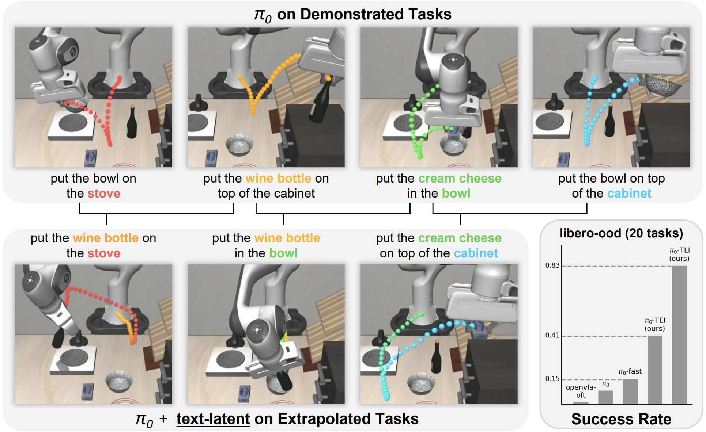

This is the official implementation of the paper: **Task Reconstruction and Extrapolation for $\pi_0$ using Text Latent**

[[Arxiv](https://arxiv.org/pdf/2505.03500)]



## Installation
The whole repo is built upon the [openpi](https://github.com/Physical-Intelligence/openpi). Thus, the
installation is the same as the openpi project.
Please clone this project first.
Then follow the Installation section of the original 
[README](https://github.com/Physical-Intelligence/openpi?tab=readme-ov-file#installation) to build the first virtual environment (venv) for 
running the pretrained checkpoint.
After this, build another venev for LIBERO env, following the [official guide](https://github.com/Physical-Intelligence/openpi/tree/main/examples/libero).

It is also required to pull the files containing text-latent from [hugging-face](https://huggingface.co/datasets/Shady0057/pi0-text-latent).
All files should be organized as `openpi/exp_data/pi0/*.pkl`.

## Running Experiments
Open two terminals, in the first one, activate the first venv run:
```bash
python scripts/serve_policy.py
```

Then in the second terminal, activate the second venv and run:
```bash
python examples/libero/main.py
```
This will by default run the extrapolation experiments, while this script actually prepared all experiments in the paper.
You can go to this script and config what experiments you would like to run.

## Text Latent Identification
For the text latent identification, we provide a script to run it at `scripts/text_latent.py`.
It will launch the model and run it on the libero-dataset to record the model's hidden states.
You don't need to setup the dataset explicitly, as the script will download the dataset automatically.

## Changes to LIBERO benchmark
The openpi project includes the LIBERO as a part of the repo. Thus we build new task suites by adding bddl files to it
and register them. The bddl files are located in the `thrid_party/libero/libero/libero/bddl_files` folder.

In addition, we slightly slack the contact threshold from 0.03 to 0.1 in `libero/envs/object_state`, as we find sometimes
when the object is indeed on the plate but the contact is not detected, which leads to the failure of the task.
Also, for putting objects on the stove tasks, we do not strictly ask the model to put it at the cooking region, 
but putting on top of the stove is counted as success.
If you are using a standard LIBERO benchmark without these two changes, the performance will drop a bit (around 5%), 
while you may find some episodes are indeed successful.

## Citation
If you find this work useful, please cite our paper:
```bibtex
@misc{li2025taskreconstructionextrapolationpi0,
      title={Task Reconstruction and Extrapolation for $\pi_0$ using Text Latent}, 
      author={Quanyi Li},
      year={2025},
      eprint={2505.03500},
      archivePrefix={arXiv},
      primaryClass={cs.RO},
      url={https://arxiv.org/abs/2505.03500}, 
}
```


